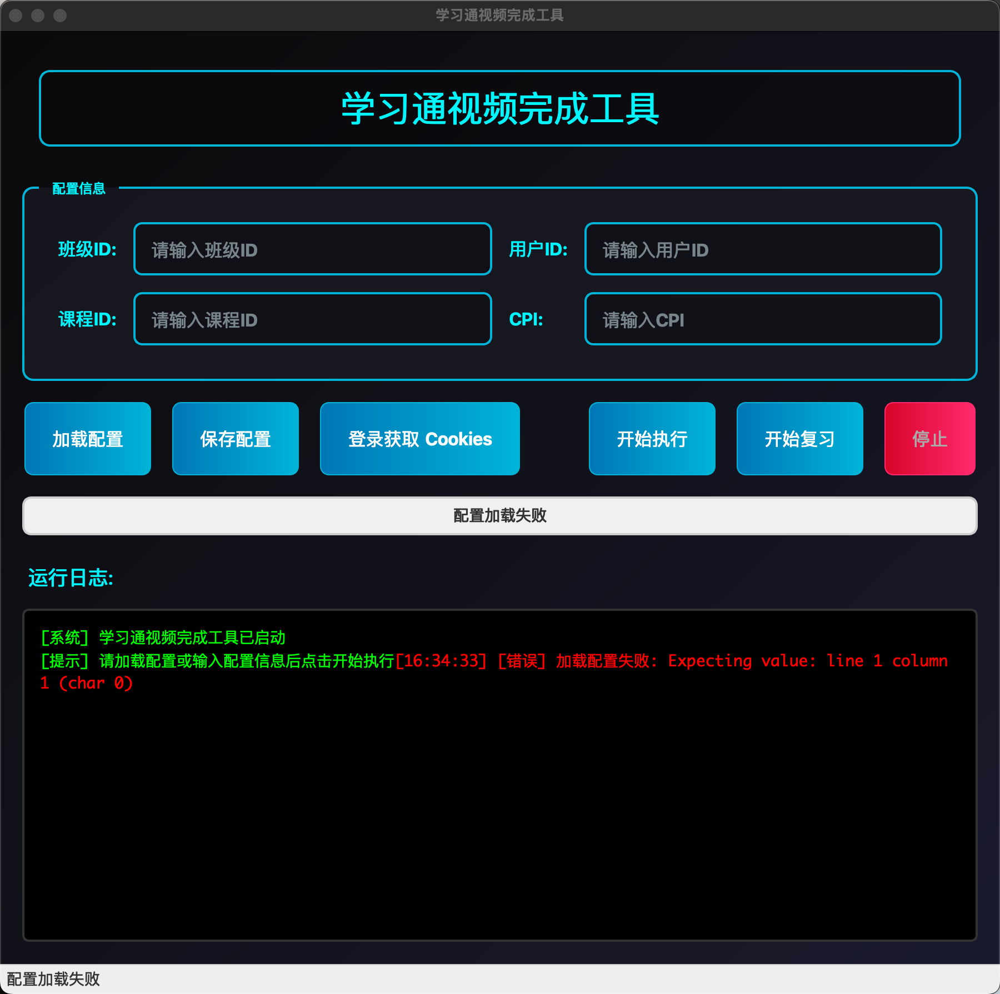

# 学习通视频完成工具

这是一个用于自动完成学习通视频任务的图形界面工具，支持视频观看和复习功能。

## 功能特点

- 自动完成学习通视频观看任务
- 支持视频复习功能
- 图形用户界面，操作简单直观
- 自动登录获取Cookies功能
- 实时显示任务执行进度和日志
- 支持配置保存和加载

## 界面预览



## 环境要求

- Python 3.8 或更高版本
- Windows/Linux/macOS 操作系统

## 安装依赖

```bash
pip install -r requirements.txt
```

额外需要安装 DrissionPage 库用于自动登录功能：

```bash
pip install DrissionPage
```

## 使用方法

### 1. 基本使用流程

1. 运行程序：
   ```bash
   python main.py
   ```

2. 点击"登录获取 Cookies"按钮进行登录（首次使用或Cookies失效时）
   - 程序会自动打开浏览器窗口
   - 在浏览器中完成学习通登录
   - 选择需要完成的课程
   - 登录信息会自动保存到 `cookies.json` 和 `config.json` 文件中
   - 进行课程空间，然后你选择你要刷的课程可以，立即就可以完成获取可课程信息保存到这个 `config.json`文件中

3. 配置信息会自动填充到对应输入框中：
   - 班级ID (clazzid)
   - 用户ID (userid)
   - 课程ID (courseid)
   - CPI (cpi)

4. 点击"开始执行"按钮开始完成视频任务
   或点击"开始复习"按钮进行视频复习

5. 查看日志区域了解任务执行状态

### 2. 手动配置（可选）

如果不想使用自动登录功能，也可以手动填写配置信息：
1. 在界面中手动输入班级ID、用户ID、课程ID和CPI
2. 确保有有效的Cookies信息（需要手动获取并放入cookies.json）

## 打包为可执行文件

### 方法一：使用build.py脚本（推荐）

```bash
python build.py
```

### 方法二：使用PyInstaller直接打包

首先安装PyInstaller：
```bash
pip install PyInstaller
```

然后执行打包命令：
```bash
pyinstaller --onefile --windowed --name "学习通视频完成工具" --icon icon.ico main.py
```

### 方法三：使用setup.py（用于pip安装）

```bash
python setup.py sdist bdist_wheel
```

## 配置文件说明

- `config.json`: 存储用户配置信息（clazzid, userid, courseid, cpi）
- `cookies.json`: 存储登录后的Cookies信息
- `video_completion.log`: 程序运行日志文件

## 注意事项

1. 请合理使用此工具，避免频繁操作导致账号异常
2. 使用前请确保网络连接正常
3. 如遇到问题，请查看日志文件获取详细信息
4. 本工具仅供学习交流使用，请遵守平台相关规则

## 常见问题

### 1. 登录时浏览器未自动打开
确保已安装 Chrome 浏览器，并且系统可以正常访问网络。

### 2. Cookies失效
当提示"当前 cookies 已失效"时，点击"是"重新登录即可。

### 3. 程序运行缓慢
首次运行时可能需要加载和解析大量数据，请耐心等待。

## 技术说明

- 使用 PyQt6 构建图形界面
- 使用 DrissionPage 实现浏览器自动化
- 使用 requests 库发送网络请求
- 使用 lxml 解析 HTML 数据
